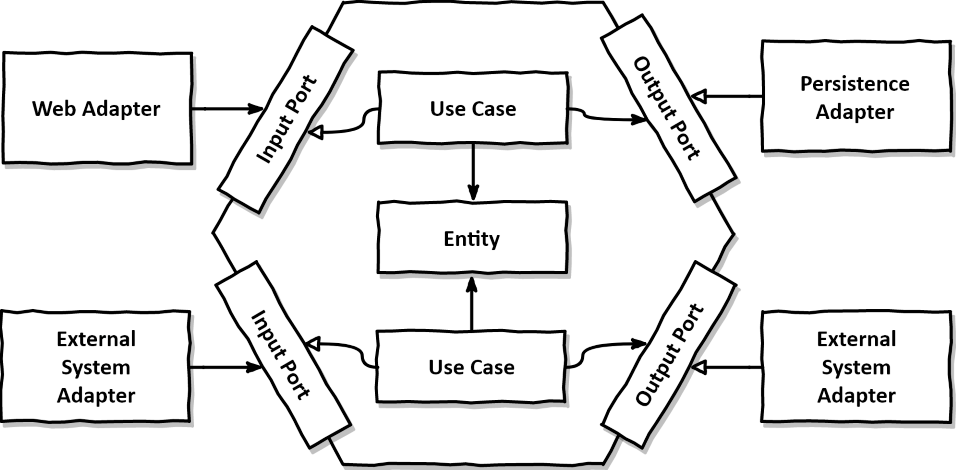

<div align="center">
<h1>Hexagonal Architecture JavaScript</h1>
<h4>Simple implementation of hexagonal architecture in JavaScript on top of <a href="https://nodejs.org/en/" target="_blank">NodeJS</a></h4>
</div>

> Hexagonal Architecture defines that an application’s business logic should be isolated from the external applications.

> The main goal of this architecture is to avoid knows structural pitfalls in software design. Such as the pollution of UI code with business logic or undesired dependencies between layers. Therefore it aims at creating loosely coupled components that can be connected to their software environments using “ports” and “adapters”.

<details>
<summary>📖 <b>Table of Contents</b></summary>
<br />

[![-----------------------------------------------------][colored-line]](#table-of-contents)

## ➤ Table of Contents

* [➤ Introduction](#-introduction)
* [➤ Getting Started (quick)](#-getting-started-quick)
* [➤ Getting Started (slower)](#-getting-started-slower)
	* [Blueprint](#blueprint)
	* [Usage](#usage)
	* [Configuration](#configuration)
* [➤ Templates](#-templates)
	* [Title](#title)
	* [Logo](#logo)
	* [Badges](#badges)
	* [Description](#description)
	* [Table of Contents](#table-of-contents)
	* [Contributors](#contributors)
* [➤ Contributors](#-contributors)
	* [License](#license)
* [➤ License](#-license)
* [➤ Load markdown files](#-load-markdown-files)
* [➤ Automatic documentation](#-automatic-documentation)
	* [my-button](#my-button)
		* [Properties](#properties)
		* [Slots](#slots)
* [➤ A bit about this readme](#-a-bit-about-this-readme)
* [➤ Custom templates](#-custom-templates)
* [➤ Advanced!](#-advanced)
	* [Check broken links](#check-broken-links)
	* [New template syntax](#new-template-syntax)
	* [Variables](#variables)
		* [Objects](#objects)
		* [1D Arrays](#1d-arrays)
		* [2D Arrays](#2d-arrays)
	* [Different colored lines](#different-colored-lines)
	* [Different formatted headings](#different-formatted-headings)
* [➤ Featured README's](#-featured-readmes)
* [➤ Future work](#-future-work)
</details>

[![-----------------------------------------------------][colored-line]](#installation)

## ➤ Walkthrough


### Built With

- [Node JS](https://nodejs.org/en/)


### Introduction
The term “Hexagonal Architecture” stems from Alistair Cockburn and has been around for quite some time14. It applies the same principles that Robert C. Martin later described in more general terms in his Clean Architecture.

<div align="center">
	<a href=""></a>
</div>

Within the hexagon, we find our domain entities and the use cases that work with them. Note that the hexagon has no outgoing dependencies, so that the Dependency Rule from Martin’s Clean Architecture holds true. Instead, all dependencies point towards the center.

Outside of the hexagon, we find various adapters that interact with the application. There might be a web adapter that interacts with a web browser, some adapters interacting with external systems and an adapter that interacts with a database.

**The adapters on the left side are adapters that drive our application (because they call our application core) while the adapters on the right side are driven by our application (because they are called by our application core).**

**To allow communication between the application core and the adapters, the application core provides specific ports.** For driving adapters, such a port might be an interface that is implemented by one of the use case classes in the core and called by the adapter. For a driven adapter, it might be an interface that is implemented by the adapter and called by the core.

The domain code has no dependencies to the outside so we can decouple our domain logic from all those persistence and UI specific problems and reduce the
number of reasons to change throughout the codebase. And less reasons to change means better maintainability.

The domain code is free to be modelled as best fits the business problems while the persistence and UI code are free to be modelled as best fits the persistence and UI problems.

### Domain Object

The domain object is the core part of the application. It can have both state and behaviour. However, it doesn’t have any outward dependency. So any change in the other layers has no impact on the domain object.

The domain object changes only if there is a change in the business requirement. Hence, this is an example of the Single Responsibility Principle among the SOLID principles of software design.

**Example of domain objects:** Suppose we are building a library application, **Book**, **User** can be a domains of our application. Similarly, in a financial application, **Account** can be a domain object.

Domain object is directly linked to business requirements and it should only be changed when the requirement changes. No other changes should be the reason to change domain object.

### Use Cases

We know use cases as abstract descriptions of what users are doing with our software. In the hexagonal architecture style, it makes sense to promote use cases to first-class citizens of our codebase.

First, let’s discuss what a use case actually does. Usually, it follows these steps:

* Take input
* Validate business rules
* Manipulate model state
* Return output

A use case in this sense is a class that handles everything around, well, a certain use case. As an example let’s consider the use case “Send money from one account to another” in a banking application. We’d create a class SendMoneyUseCase with a distinct API that allows a user to transfer money. The code contains all the business rule validations and logic that are specific to the use case and thus cannot be implemented within the domain objects. Everything else is delegated to the domain objects (there might be a domain object Account, for instance).

Similar to the domain objects, a use case class has no dependency on outward components. When it needs something from outside of the hexagon, we create an output port.

A use case takes input from an incoming adapter. If the business rules were satisfied, the use case then manipulates the state of the model in one way or another, based on the input. Usually, it will change the state of a domain object and pass this new state to a port implemented by the persistence adapter to be persisted. A use case might also call any other outgoing adapter, though.

The last step is to translate the return value from the outgoing adapter into an output object which will be returned to the calling adapter.

While **validating input is not part of the use case logic**, validating business rules definitely is. Business rules are the core of the application and should be handled with appropriate care.

A very pragmatic distinction between the two is that validating a business rule requires access to the current state of the domain model while validating input does not. Input validation can be implemented declaratively, such as `amount` should not be null when sending money, while a business rule needs more context.

We might also say that input validation is a syntactical validation, while a business rule is a semantical validation in the context of a use case.

Let’s take the rule “the source account must not be overdrawn”. By the definition above, this is a business rule since it needs access to the current state of the model to check if the source and target accounts do exist. **The best way is to do put the business rules into a domain entity.**

In contrast, the rule “the transfer amount must be greater than zero” can be validated without access to the model and thus can be implemented as part of the input validation (**this type of validations should be put inside the implementation of input port for use case**).

### Ports
The ports are interfaces that allow inbound and outbound flow. Therefore, the core part of the application communicates with the outside part using the dedicated ports.

The domain objects and use cases are within the hexagon, i.e. within the core of the application. Every communication to and from the outside happens through dedicated “ports”.

#### Input Ports (Inbound Ports)

The inbound port exposes the core application to the outside. It is an interface that can be called by the outside components. These outside components calling an inbound port are called primary or input adapters.

**Examples:** In a banking application, examples of input port inside account service (implemented by account use case) are: get account by ID, add account, remove account.

#### Output Ports (Outbound Ports)

The outbound port allows outside functionality to the core application. It is an interface that enables the use case of the core application to communicate with the outside such as database access. Hence, the outbound port is implemented by the outside components which are called secondary or output adapters.

**Examples:** In a banking application, a simple example of output port is that which fetches account from database by ID provided from input port. Another example is that which adds a new account in database with details provided by input port.

### File Structure

```
src/
 ├──app/                   * WebApp: folder, our source files that will be compiled to javascript
 │   │--shared/            * Do put all shared files within a component feature in a shared folder.
 |   |   |-- exception.service.ts
 |   |   |-- exception.service.spec.ts
 |   |   |-- shared.module.ts * shared module with all shared declarations and providers
 |   |   |-- index.ts             * barrel file
 │   |--app.module.ts      * angular module
 │   |--app.component.ts   * root component
 │   │──app.spec.ts        * a simple test of components in app.ts
 │   │──index.ts           * barrel file
 │   │
 │──assets/                * static assets are served here
 │   ├──icon/              * our list of icons from www.favicon-generator.org
 │   ├──images/            * our custom app images
 │   ├──service-worker.js  * ignore this. Web App service worker that's not complete yet
 │   ├──robots.txt         * for search engines to crawl your website
 │   └──human.txt          * for humans to know who the developers are
 |──main.ts        * our entry file for our browser environment
 │
 |──index.html     * Index.html: where we generate our index page
 │
 |──polyfills.ts   * our polyfills file
 │
 |──vendor.ts      * our vendor file
 |
 └──globals.d.ts   * our custom global type definitions
```

### Testing Setup
All tests are also written in ES6. We use Webpack to take care of the logistics of getting those files to run in the various browsers, just like with our client files. This is our testing stack:
* Karma
* Webpack + Babel
* Mocha
* Chai

To run tests, type `npm test` in the terminal. Read more about testing [below](#testing).


[![-----------------------------------------------------][colored-line]](#installation)

## ➤ Getting Started

### Dependencies
Tools needed to run this app:
* `node` and `npm`

#### Install Node.js

Node.js is an environment that can run JavaScript code outside of a web browser and is used to write and run server-side JavaScript apps. Node.js installation includes `npm`, the package manager that allows you to install NPM modules from your terminal. 
You can download an installer from the [Node.js homepage](https://nodejs.org/en/).

##### Check your Node.js installation

Check that you have the minimum required version installed by running the following command:

```sh
node -v
```

You should see a version larger than Node 10.

```sh
node -v
v12.14.0
```

> Project name' minimum supported Node.js version is Node 10, but more recent versions will work as well.


### Installing
* `fork` this repo
* `clone` your fork
* `npm install` to install dependencies

### Running the App
NG6 uses Gulp to build and launch the development environment. After you have installed all dependencies, you may run the app. Running `npm start` will bundle the app with `webpack`, launch a development server, and watch all files. The port will be displayed in the terminal.
 
#### Tasks
Here's a list of available tasks:
* `npm run build`
  * runs Webpack, which will transpile, concatenate, and compress (collectively, "bundle") all assets and modules into `dist/bundle.js`. It also prepares `index.html` to be used as application entry point, links assets and created dist version of our application.
* `npm run serve`
  * starts a dev server via `webpack-dev-server`, serving the client folder.
* `npm run watch`
  * alias of `serve`
* `npm start` (which is the default task that runs when typing `gulp` without providing an argument)
  * runs `serve`.
* `npm run component`
  * scaffolds a new Angular component. [Read below](#generating-components) for usage details.
  
### Testing
To run the tests, run `npm test`.

`Karma` combined with Webpack runs all files matching `*.spec.js` inside the `app` folder. This allows us to keep test files local to the component--which keeps us in good faith with continuing to build our app modularly. The file `spec.bundle.js` is the bundle file for **all** our spec files that Karma will run.

Be sure to define your `*.spec.js` files within their corresponding component directory. You must name the spec file like so, `[name].spec.js`. If you don't want to use the `.spec.js` suffix, you must change the `regex` in `spec.bundle.js` to look for whatever file(s) you want.
`Mocha` is the testing suite and `Chai` is the assertion library. If you would like to change this, see `karma.conf.js`.

#### Examples

It's always easier to learn something if you have an examples. Here is a list of repos which based on this starter:

 - [TodoMVC Example App](https://github.com/AngularClass/NG6-todomvc-starter)

### Usage

Run the `node_modules/.bin/readme generate` command and a README file will be generated for you. If you want to go into depth with the readme command, check out the following options or write `node_modules/.bin/readme generate -h` in your terminal if that's your cup of tea.


| Option                | Type                                             | Description                                      |
|-----------------------|--------------------------------------------------|--------------------------------------------------|
| -c, --config          | string                                           | Path of the configuration file. Defaults to 'blueprint.json |
| -p, --package         | string                                           | Path of the 'package.json' file. Defaults to 'package.json'. |
| --pkg.name            | string                                           | Name of the project. Used for the 'title' template. |
| --pkg.contributors    | {name: string; email: string; url: string; img: string; info: string[];}[] | Contributors of the project. Used for the 'contributors' template. |
| --pkg.license         | string                                           | License kind. Used for the 'license' template.   |
| -o, --output          | string                                           | Path of the generated README file. Defaults to 'README.md'. |
| -h, --help            |                                                  | Display this help message.                       |
| -i, --input           | string                                           | The blueprint. Defaults to 'blueprint.md'.       |
| --badges              | {alt: string, url: string, img: string}[]        | Badges. Used for the 'badges' template.          |
| --text                | string                                           | Text describing your project. Used for the 'description' template. |
| --demo                | string                                           | Demo url for your project. Used for the 'description' template. |
| --lineBreak           | string                                           | The linebreak used in the generation of the README file. Defaults to 'rn' |
| --tab                 | string                                           | The tab used in the generation of the README file. Defaults to 't' |
| --placeholder         | [string, string]                                 | The placeholder syntax used when looking for templates in the blueprint. Defaults to '["{{", "}}"]. |
| --line                | string                                           | The line style of the titles. Can also be an URL. Defaults to 'colored'. |
| --templates           | {name: string, template: string}[]               | User created templates.                          |
| -s, --silent          | boolean                                          | Whether the console output from the command should be silent. |
| -d, --dry             | boolean                                          | Whether the command should run as dry. If dry, the output file is notgenerated but outputted to the console instead. |
| --headingPrefix       | {[key: number]: string}                          | The prefix of the header tags. Defaults to '{1: "➤ ", 2: "➤ "}' |
| --logo                | {src: string; alt?: string; width?: number; height?: number;} | The logo information. Used for the 'logo' template. |
| --contributorsPerRow  | number                                           | The amount of contributors pr row when using the 'contributors' template. Defaults to '6' |
| --documentationConfig | object                                           | Configuration object for automatic documentation template. |
| --extend              | string                                           | Path to another configuration object that should be extended. |
| --checkLinks          | boolean                                          | Checks all links for aliveness after the README file has been generated. |


<!-- MARKDOWN LINKS & IMAGES -->
<!-- https://www.markdownguide.org/basic-syntax/#reference-style-links -->
[colored-line]: ./.docs/lines/colored.png
[project-logo]: ./.docs/logo.png
